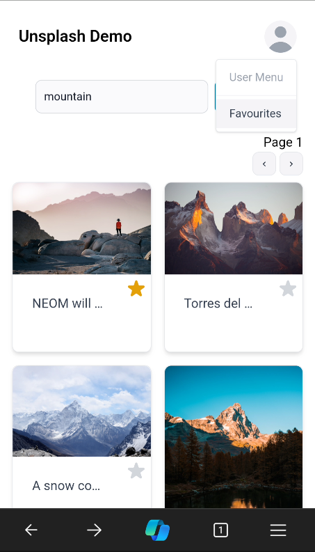
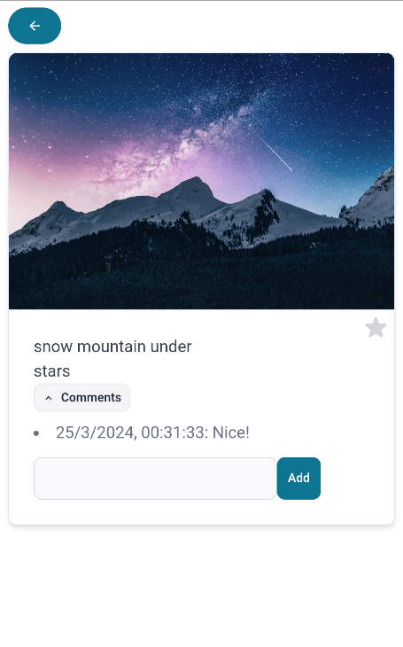
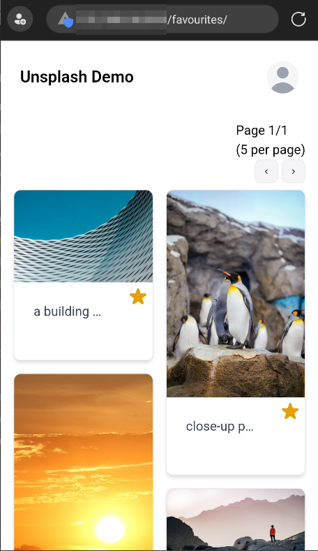

<h1 align="center">
  demo-unsplash 📸
</h1>
<h3 align="center">
  <a href="https://unsplash-demo-innovazione.netlify.app/">Visit the site (via netlify, recommended)</a> <br>
  <a href="https://smx-smx.github.io/demo-unsplash/">Visit the site (via github pages, might have caching issues)</a>
</h3>

[](https://app.netlify.com/sites/unsplash-demo-innovazione/deploys)

## Usage Instructions
Enter the search term, and press Search

Tap the little star to mark favourite pictures



Touch a picture to view and save comments



Favourites can be viewed from the user menu in the top right corner



## 🚀 Quick start

1.  **Clone the repository**

    Clone the repository locally using `git`

    ```shell
    git clone https://github.com/smx-smx/demo-unsplash.git
    ```

2.  **Install dependencies**

    Navigate into your new site’s directory and start it up.

    ```shell
    cd demo-unsplash
    npm install
    ```

3.  **Run the development environment**

    Execute the following command, still from the same directory

    ```shell
    npm run develop
    ```

4.  **Open the website. Provide the API key when prompted**

    The website is now running at http://localhost:8000

    When prompted, provide your Unsplash API key
